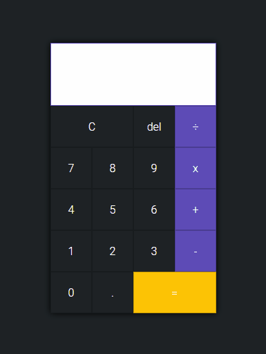

# Calculadora - VanillaJs

Calculadora criada utilizando HTML CSS e JavaScript puro (vanilla ES6+)

 
 

Este projeto visa o aprendizado com as bases do HTML, CSS e JavaScript puro (ES6+).

## :man_technologist: As tecnologias utilizadas foram

* HTML;
* CSS;
* Javascript Vanilla(ES6+)
